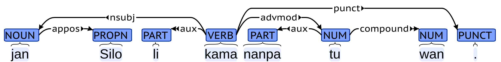
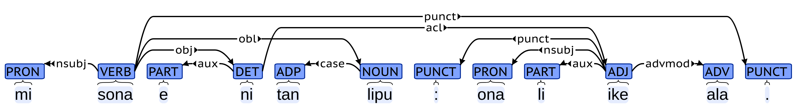
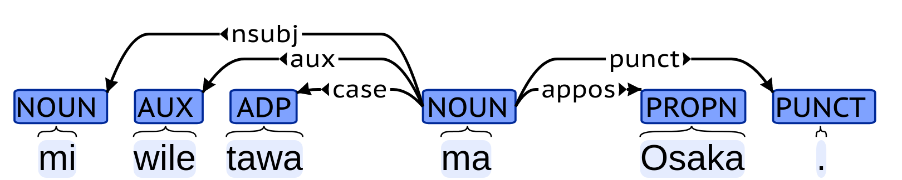
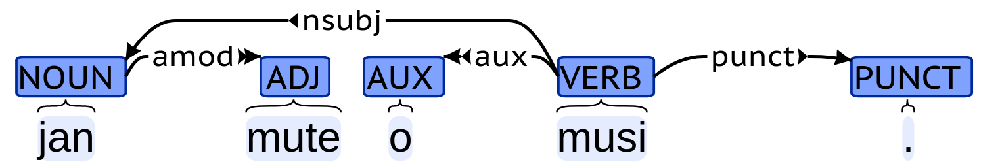
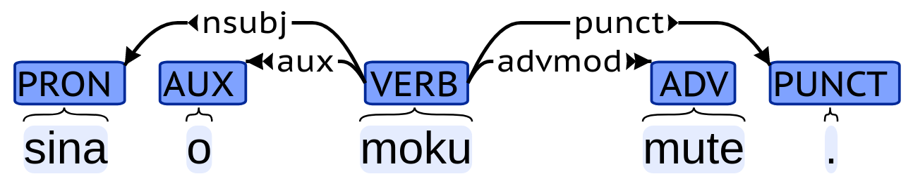

# Toki Pona UD

困ったことに，世の中にはたくさんの言語があります．
異なる言語の間で，共通の規則を用いて依存構造のアノテーションを行うための枠組みとして，Universal Dependencyと呼ばれるものがあります．
また，その中で使われている品詞体系として，Universal POS tagsと呼ばれるものもあります．
nymwaさんは，トキポナ版のUniversal DependencyやUniversal POS tagsを設計しようと思い立ち，頑張っています．
今回のアドベントカレンダーでは，その中で得られた知見を共有します．

## Universal Dependency

Universal Dependencyは，さまざまな言語での言語横断的な構文の構造を設計するための試みです．よくUDと省略されます．
「いろんな言語の構文解析を同じ枠組みでやるぞー」という思想の人たちが，それを実現するために頑張って作っています．
UDが始まったのは2014年のことで，それから100以上の言語でUDが設計されています．
UDにもいろいろありますが，この記事で出てくるUDは，UD version 2.です．
詳しいことは，https://universaldependencies.org/ かあるいは，https://aclanthology.org/2020.lrec-1.497.pdf を見てくれもふ≡╹ω╹≡．

UDでは，Universal POS tagsとして，17種類の品詞タグセットを採用しています．
以下に，Universal POS tagsのすべてのタグを示します．

| タグ | 意味 |
| --- | --- |
| ADJ | 形容詞 |
| ADP | 接置詞 |
| ADV | 副詞 |
| AUX | auxiliary (助動詞など) |
| CCONJ | 等位接続詞 |
| DET | 限定詞 |
| INTJ | 間投詞 |
| NOUN | 名詞 |
| NUM | 数詞 |
| PART | 接辞，小辞 |
| PRON | 代名詞 |
| PROPN | 固有名詞 |
| PUNCT | 約物 |
| SCONJ | 従属接続詞 |
| SYM | 記号 |
| VERB | 動詞 |
| X | その他 |

トキポナでUDをするためには，まず，すべての単語がどのUniversal POS tagsのタグを取りうるかを考える必要があります．

Universal Dependencyの係り受けは，その"言語横断的"という特徴から，句構造（構文木とか）を考慮したものではなく，
すべての構文関係を，単語間の依存関係と係り受けタグで表現します．
UDの係り受けタグは，なんかよくわからんが[たくさんあり](https://universaldependencies.org/u/dep/index.html)ます．
これらのすべてをトキポナと関連付けようとするとしんどいので，以降は
[jan Nankoのトキポナ文法解説ツイート](https://twitter.com/leenamgwang/status/1409484535151042568)
の例文を用いて，トキポナUDについて説明していきます．

## 主部・述部

### pan li moku.

"pan li moku."は，「パンは食べ物だ」という意味であり，pan「パン」, moku「食べ物」の品詞は，NOUNです．
liは，主部と述部を分離する語です．
今回のトキポナUDでは，liは，PARTということにしました．これは異論もあるかもしれませんが，受け入れてください．
'.'は約物なので，PUNCTです．

係り受け解析では，ある語には別の語から矢印が飛んできます．
矢印の矢はず側，例えばこの図の「pan <- moku」のmoku側は，「panの主辞 (head)」と言います．
さらに，すべての語から主辞をたどって到達する語のことを，文の主辞 (root) と言います．この文では，mokuが文の主辞です．
文の主辞は必ず１つになります．
２つ以上ある場合は，それは，そもそも２つ以上の文ということになりますし，
主辞が０個という場合は，矢印の循環が起きるということになってしまいます．
係り受けの矢印は必ず循環しないように付ける必要があります．

UDでは，文の主辞以外のすべての語が，主辞を持ちます．つまり，どの語にも必ず何かしらの矢じりがついているということです．
ある語が２つ以上の主辞を持つことも許容されますが，今回のトキポナUDにおいては，そのようなことは起きないように設計しました．
つまり，トキポナUDでは，文の主辞以外のすべての語は，必ず１つの主辞を持ちます．

「pan <- moku」の係り受けには，nsubjのタグが付いています．これが，係り受けタグです．
nsubjは，noun subjectの略で，（名詞）主語を表します．

「li <- moku」の係り受けは，auxです．auxは，auxiliaryの略で，一般に，述語に係ってその役割を決定付ける語であることを意味します．
英語の助動詞がそれで，時制や態，法，証拠性などを表します．
ただ，UDでは，述語以外の要素に役割を付与するような語にも，auxの使用を許しています．
トキポナには，そのような語（後述する，eやpiなど）が複数あります．
今回の例においては，liは述語の役割を決定付けるものであり，auxとするのが良いように思われます．

「moku -> .」の係り受けは，punctです．これは，punctuationの略で，約物であることを表します．

### kili li suwi.

"kili li suwi."は，「果物(kili)は甘い(suwi)」という意味であり，suwiは，ADJになります．

kiliが主語，suwiが述語となり，係り受けは，"pan li moku."の場合と全く同様になります．

### jan li moli.

"jan li moli."は，「人(jan)は死ぬ(moli)」という意味であり，moliは，VERBになります．

janが主語，moliが述語となり，係り受けは，また同様になります．

### kala li lon telo li pona moku.

"kala li lon telo li pona moku."は，「魚は水中にいて，おいしい」という意味です．

主語はkala「魚」ですが，述語は"li lon telo"と"li pona moku"の２つあります．
この場合，１つ目の述語の主部"telo"と２つ目の述語の主部"pona"が「telo -> pona」のように結び付けられ，その係り受けタグは，conj:predとなります．
conjは，conjunctionの略で，本来，２つの要素が等位構造を持つ場合，その関係を示す働きがあります．
トキポナの場合，等位構造にも複数の種類があり，本来の等位接続詞を用いる等位構造以外のものには，"conj:???"というふうに，なんらかの補足説明を付けるようにしました．
"conj:pred"のpredは，それが述語(predicate)の等位関係，すなわち，"li ~~~ li ~~~ li ~~~"の関係にあることを意味します．
一方で，無印のconjは，接続詞taso, en, anuなどに対して用いられます．

１つ目の述語，"li lon telo"は，前置詞lon「〜の中にある」からなる前置詞句です．
UDでは，前置詞句における主辞は前置詞ではなく，前置詞の後ろに来る名詞句となります．
そのため，「lon <- telo」と，この句の主辞はtelo「水」になります．
その係り受けタグは，格を意味する'case'になります．

２つ目の述語，"li pona moku"は，形容詞 'pona' 「良い」に，副詞 'moku' 「食べるために」が付き，「食べるために良い」-> 「おいしい」という意味です．
副詞の修飾は'advmod'タグで表されるため，「pona -> moku」の関係は，advmodです．

約物の係り受けは，複数の述語に対しては，先頭のものに係ります．

### mi pilin ike li moli.

"mi pilin ike li moli."は，「私はつらくて死んだ」という意味です．

この例も，述語が２つあります．いずれも述語は動詞句で，１つ目の"pilin(感じる) ike(悪く)"は，動詞句に副詞修飾があるのみで，これまで説明した内容で理解できます．

## 修飾

### lipu loje, tomo sina, tawa sewi, moku mute, pona kute

名詞lipu「葉」に対して，形容詞loje「赤い」が係る名詞句です．
形容詞修飾語(adjective modifier)を表すamodタグが付けられています．

名詞tomo「家」に対して，代名詞sina「あなた」が係る名詞句です．
名詞修飾語(noun modifier)を表すnmodタグが付けられています．

動詞tawa「行く・飛ぶ」に対して，副詞「高く」が係る動詞句です．
副詞修飾語(adverbial modifier)を表すadvmodタグが付けられています．

名詞sewi「空」に対して，前置詞tawa「〜の方へ」が係る前置詞句です．
格標識を表すcaseが付けられています．

１つ前の"tawa sewi"と同じ句ですが，意味合いは微妙に違ってきています．
前者は「高いところを飛ぶ」という，移動の動詞に場所の副詞を組み合わせた空間性の移動表現であるのに対し，
後者は「空の方へ行く・飛んでいく」という，動作の方向や状態の変化を表す前置詞を用いた方向性の移動表現です．

この違いが文脈上明確な場合には，係り受けは一意に定められるべきですが，どちらの意味にも取れる場合，
すなわち，意味に曖昧さがある場合には，２通り以上の注釈を行うことが望ましいと言えます．
ただし，トキポナの場合は，すべての可能な解釈を列挙することは重要度が低く，意味としてもっともらしい事例に限り注釈を行うことも大切だと言えます．

名詞moku「食べ物」に対して，形容詞「たくさんの」が係る名詞句です．
形容詞修飾語を表すamodタグが付けられています．

動詞moku「食べる」に対して，副詞「たくさん」が係る動詞句です．
副詞修飾語を表すadvmodが付けられています．

この２例も，曖昧さの問題があります．
曖昧さはトキポナにおいて非常に重要な問題です．
トキポナUDでは，なるべくUDの枠組みにのっとって曖昧な事例を列挙するように心がけています．
一方，そもそも，このような曖昧さは既存の品詞体系を用いているためであるという立場から，トキポナにおいて名詞や動詞，形容詞や副詞という分類を用いることに否定的な立場もあります．
たしかに，この区別がトキポナの形態論や統語論に与える影響は，ほとんどの場合においてはありません．
しかし，時間的経過を伴わない事物と，動作・状態の間での区別を文脈から行うことは，人間の言語一般において自然なことと考えることもできますし，
係り受け解析の問題や，あるいは意味・語用の問題として，この区別の問題に取り組むことは，決してナンセンスなことではないとも言うことができるのではないかと思います．

形容詞pona「良い」に対して，副詞「聞くために」が係る形容詞句です．「聞き心地が良い」と訳されます．
kuteは，名詞では「耳」，動詞では「聞く」，副詞では「聞くために」となります．
トキポナ文の解釈においては，文脈上適切な品詞・語義の選択をする必要があります．

## 前置詞

### ona li lon ma ni.

代名詞ona「彼，彼女，それ」が主語'nsubj'で，述部"li lon ma ni"で，文の意味は「それはここにある」です．
前置詞句"lon ma ni"の主辞は"ma"「場所」です．
限定詞(determiner)である"ni"は，文脈における指示をする"その"の意味の役割を果たしており，係り受けタグはdetとなります．
"ma ni"で，「その場所」という意味となり，ここでは「ここ」と訳しています．

### soweli li lape lon insa lupa.

訳は「動物が穴の中で眠る」です．
主語はsoweli「かわいい動物」です．≡╹ω╹≡そうぇり．
文の主辞は動詞lape「眠る」で，その場所を前置詞句"lon insa lupa"で表しています．
oblは，斜格要素(oblique)を表すタグで，トキポナUDにおいては，述部にかかる前置詞句であることを表します．

名詞insa「〜の内部」は位置関係を表す名詞であり，"lon insa 〜"は「〜の中に，〜の中で」という意味です．
名詞lupa「穴」は，insaに係り，これは名詞修飾語nmodです．

述部に係る名詞句は主語nsubj，目的語objがあります．
名詞句以外で述部に係るような句を表すタグとしては，斜格要素oblの他に，呼格vocativeがあります．

### soweli lon tomo mi li suwi.

訳は「私の家にいる動物はかわいい」です．
述部は"lon tomo mi"「私の家で」と"li suwi"「かわいい」です．
代名詞"mi"は"tomo"に名詞修飾nmod，"suwi"は"tomo"に述部の等位構造で係っています．

## 否定

### kasi li toki ala.

否定の副詞alaが副詞修飾語として動詞toki「話す」に係っています．
主語kasiは「植物」の意で，文意は「植物は話さない」です．

### kasi li toki e ala.

トキポナでは，述部と目的語を分離する語としてeを用います．
目的語(object)を表すタグはobjです，eはPARTで，目的語を主辞とするauxとしてタグ付けされます．これは，述語とliの関係性と同じ形になっています．
さらに言えば，後で出てくる名詞句とpiの関係性とも同じです．
目的語を取るeが入ると，alaを代名詞「何も〜ない」と解釈することができ，「植物は何も話さない」という意味になります．

alaは名詞「無」と解釈することもでき，その場合，「植物は無について話す」という意味になります．
ただ，この解釈は多くの場合，適切ではないと考えられます．
alaは，他にも形容詞「なにも〜ない」「誰も〜ない」や，数詞「０」などの解釈が可能です．

### akesi li suwi ala.

akesiは「トカゲ・爬虫類」の意味です．
「トカゲはかわいくない」となります．

### jan ala li moku e kiwen.

このalaは形容詞「誰も〜ない」の意で，「誰も石(kiwen)を食べない」となります．

## 動作の対象

### soweli li moku e kasi.

「動物(soweli)は植物(kasi)を食べる(moku)」です．
目的語はobjタグで表され，eはauxで係ります．

### mama li alasa e kili e soweli.

「親(mama)は果物(kili)と動物(soweli)とを狩る(alasa)」です．
目的語は"e ~ e ~"の形で並置され，conj:objタグで等位構造を表します．
述語の等位構造を表すconj:predと同じ形になっています．

## 諾否疑問

nymwaさんはこれのせいで土下座しながら大田区を一周することになってしまいました．

### sina moku ala moku e soweli?

トキポナには，諾否疑問を表す方法が２通りあり，その１つが，"動詞 ala 動詞"の形で動詞を反復する方法です．
これは，中国語の反復疑問文と同じ形です．
この文は，「あなたは肉(soweli)を食べますか」の意です．
moku「食べる」を"動詞 ala 動詞"の形にした，moku ala mokuが「食べますか」という諾否疑問になります．
mokuの反復は，等位構造と捉え，conj:repとしてタグ付けしています．

alaは否定の副詞ではなく，小辞(PART)としました．
これは，中国語の"動詞句 不 動詞句"が，「肯定形 ＋ 否定形」となっているのとは異なり，トキポナのalaに否定の副詞としての機能があるとは言えないと考えるためです．
もし，alaが否定語であるならば，トキポナの原則から，位置的に前にある語句に係るはずですが，前にある動詞句に否定語が副詞修飾すると解釈する理由がありません．
そのため，このalaは小辞(PART)と捉え，後ろ側の動詞が取るauxiliaryと解釈することとしています．

疑問符?は，'.'と同様に文の主辞に係り，タグはpunctです．

### ni li pipi ala pipi?

反復による諾否疑問は，名詞述語にも使えます．
「これは虫(pipi)ですか」という意味です．

### waso li tawa sewi anu seme?

「鳥(waso)は飛び(tawa sewi)ますか」

諾否疑問を表す２つめの方法は，文末に"anu seme?"を付けるものです．
等位接続詞anuは，品詞タグはCCONJで，係り受けタグはccです．
ccは並置される後ろ側の要素を主辞とするため，疑問代名詞semeに係ります．
tawa sewiとsemeの並置は，接続詞を用いる等位構造のため，係り受けタグは無印のconjになります．

## 選択疑問・疑問詞疑問

### sina moku e seme?

「あなたは何(seme)を食べますか」

疑問代名詞semeを用いて疑問詞疑問文を作ることができます．
semeは代名詞として扱っているので，名詞修飾語nmodとしてタグ付けされます．
ただし，その意味が形容詞的であることも許容されます．

### jan seme li kama?

「誰が来ますか」

jan seme「誰」，ma seme「どこ」，tenpo seme「いつ」などの定形表現も，semeの係り受けはnmodです．

トキポナにおいては，例えば，"jan seme li lon ma seme?"など，疑問代名詞が複数現れる文は非文であることが多いと考えられます．
自分は，このような種類の文で非文にならない例がどれぐらいあるのかよくわかっていません．
気づいた方は教えていただけると助かります．

### sina olin e mi anu ona?

「あなたは私とあのひとのどちらを愛しますか」

接続詞anuを用いて選択疑問文を作ることができます．
anuはCCONJで，係り受けタグがcc，等位構造はconjで表されます．

## piの用法

### kala suli mute

「たくさんの(mute)大きな(suli)魚(kala)」

トキポナでは，修飾関係は原則左結合です．
左結合ってなんだという話ですが，結びつきの順番が引き算と同じという意味です．
例えば，引き算は "3 - 2 - 1" と書いたとき，まず "3 - 2 (=1)" を計算し，次に "1 - 1"を計算します．
また，これは，この式が "(3 - 2) - 1" と書き直しても同じということです．このように，３つの要素があったときに，左側の２つの要素が先にくっつく性質を左結合性と言います．
ちなみに，右結合性の例としては，べき乗があります．（2^3^4 = 2^(3^4)）

kala suli muteの場合，結びつきの関係は，((kala suli) mute)と書くことができます．左結合なので，左側の"kala suli"が優先的にくっつきます．
"kala suli"は「大きい魚」であり，それに，mute「たくさんの」が付くため，"kala suli mute"で「たくさんの大きな魚」です．

suliはkalaに係るため，その主辞はkalaであり，muteは"kala suli"に係るため，その主辞kalaに係ります．

### kala pi suli mute

「とても(mute)大きい(suli)魚(kala)」

一方で，トキポナの原則である左結合の枠組みを外れた形での結びつきの関係を作りたい場合，小辞'pi'を使うことで実現できます．
小辞'pi'が用いられた位置は，修飾の結びつきの優先度が低くなります．
"kala pi suli mute"の場合，左結合の原則に基づけば，"kala suli"が優先的に結びつきますが，'pi'があるためにそうはならず，"suli mute"が優先的に結びつきます．
そのため，結びつきの関係は，(kala pi (suli mute))となります．
この場合，suliは形容詞「大きい」で，それに係るmuteは副詞「とても」であり，"kala pi suli mute"は「とても大きい魚」という意味になります．

muteはsuliに係るため，その主辞はsuliであり，suliは"kala"に係るため，その主辞はkalaになります．

小辞piの係り受けは，直後の句を主辞とするauxとしてラベル付けされます．

## 固有名詞

### jan Talo, toki Inli, ma Tosi, jan Tosi

「太郎（人名）」

固有名詞(PROPN)は，同格apposで係ります．
これは，トキポナにおける固有名詞が名詞修飾を行うものではないと考えるためです．
英語において，"President Obama"の'Obama'が同格であるのと同じです．

「英語 (English)」

言語名が同格で表されています．

「ドイツ (Deutsch)」

maは場所の意味です．

地名が同格で表されています．

「ドイツ人」

Tosiを「ドイツ（地名）」だと考えると，「ドイツの人」という意味で，同格ではなく名詞修飾と言えることになります．
しかし，その場合，"jan pi ma Tosi"と言う方が適切であり，この場合のTosiは「ドイツ人」を指す集合的な意味の固有名詞とする方が自然だと考えられます．
そのため，この場合も，係り受けはapposになります．

トキポナにおける固有名詞は，例えば，単独で用いることができないなど，その用法が自然言語によく見られるものと異なっており，
係り受けをどのように解釈するのが適切なのか非常に難しいです．
名詞修飾と考えるべき場合，敬称と考えるべき場合，あるいは，固有名詞側が主辞となるべき場合などがないと言い切ることはできません．
トキポナにおける固有名詞の面白い用法について気づいた人は教えてください．
≡╹ω╹≡をさしあげます．

## laの用法

### jan olin li pilin pona, la mi pilin pona.

「恋人(jan olin)がうれしけ(pilin pona)れば私もうれしい」

小辞laを用いて "文1, la 文2" とした場合，「文1ならば，文2」という，条件の文ができます．

小辞laは，後側の（部分的な）文の主辞に係り，そのタグはauxです．
laの前に来るカンマはなくてもよく，ある場合は，後側の文の主辞に係り，そのタグはpunctです．
このカンマは，後側の文が前側の文を意味的に分離させているものと捉えられるので，後側の文に係ります．
前側の文の主辞は，後側の文の主辞にadvclで係ります．
これは，副詞的修飾節(adverbial clause)の略です．
前側の文は後側の文全体に副詞的に係る節ということです．

### tenpo pini, la mi lon ma Nijon.

「私は昔，日本に住んでいた」

"名詞句, la 文"で，「（名詞句）に（文）」という文を作ることができます．
"tenpo pini"は，「過去の時点で」「かつて」「昔」という意味の時間を表す名詞句で，laの後ろの文の述部に係る斜格要素oblとタグ付けされます．
トキポナ公式本では，これは，"lon 名詞句"のlonを省略して，文頭に移動させたものとしています．
そのため，このlaの前の名詞句は，格標識を伴わない斜格要素と考えています．

"ken la"「おそらく」などの表現もありますが，"ken"を名詞句と捉えたり，"lon ken"を前置詞句と捉えることは不自然であるため，
これは，副詞の特殊な用法と捉え，kenは副詞ADVで，文の主辞に副詞修飾語advmodとして係るとします．

### tan seme, la jan li moli?

「どうして人は死ぬのですか」

"前置詞句 la 文"は，文中の前置詞句を文頭に倒置させた文と解釈できます．
そのため，係り受けは斜格要素oblとなります．
文頭に移動することで，話題化・主題化を行っていると考えることができます．
この例では，疑問代名詞を含む前置詞句"tan seme"を文頭に移動させています．
疑問代名詞を含む前置詞句のlaを用いた文頭への移動は，トキポナにおいてよく見られ，wh-移動との類似性も指摘できるかもしれません．
また，論理関係を表す"tan ni, la..."も，よく用いられます．

注意点として，laによって移動することができるのは，斜格要素の前置詞句に限ります．
述部の前置詞句は，laによって移動できないと考えられます．
例えば，"ona li lon seme?"「彼はどこにいる？」という文は，述語が前置詞句です．
これを無理矢理文頭に移動させると，"lon seme la ona li?"とできますが，liは単独で述語となれず，これは非文です．"lon seme la ona?"としても，非文です．

laを用いた前置詞句の移動については，個人的に２つ未解決な点があります．
１つ目は，niを用いて表される内容の内部でも可能であるかという点です．
例えば，"sina sona e ni: ona li kama lon tenpo ni."「彼が今来たということをあなたは知っている」という文（この文に出てくる'ni:'の用法は後で説明があります）の，"lon tenpo ni"は，
"sina sona e ni: tenpo ni la ona li kama."と言い換えることができるのでしょうか？
文法的な問題点はないかもしれませんが，これを許容するかという点は，人によって意見が分かれるのではないかと思っています．
もしかしたら，多くの人がlaによる前置詞句の移動を不自然と捉えるような別の文例があるかもしれません．
laによる前置詞句の移動は，話題や焦点の問題とも関連しており，niが導く内容の節での問題は，従属節における話題性の問題とも捉えることができるかもしれません．
２つ目は，前置詞句が文をまたいで移動することは許されるのかという点です．
例えば，"sina sona e ni: ona li kama lon tenpo ni."を"tenpo ni la sina sona e ni: ona li kama."と書き直すと意味が変わってしまいます．
しかし，このような文をまたいだ前置詞句の移動が文意を変えず可能である場合というのはあるのでしょうか？
これらの問題は未だにわかっていないのですが，なにかおもしろい文例が思いついた場合は教えていただけると助かります．
面白い文例に対しては，≡╹ω╹≡をさしあげます．

## 数と色

### jan luka luka tu wan

「13 (= 5 + 5 + 2 + 1)人の人」

トキポナでは，数は'wan'「1」, 'tu'「2」, 'luka'「5」の組み合わせで表します．
13は，5で割った商が2，余りが3，
3は，2で割った商が1，余りが1であり，
13 = 5 * 2 + 2 * 1 + 1となるため，13は，luka luka tu wanと表されます．

数には基数と序数があります．基数は"量"「１個，２個，...」，序数は"順番"「１つ，２つ，...」です．
日本語では基数と序数の区別は"個，番"などの類別詞が担います．英語では，oneに対するfirstなど，語彙が別になっています．
トキポナでは，数はそのままの形では基数です．
"luka luka tu wan"のように複数の語が並びますが，これは１つの複合語として捉えます．hot dogが複合名詞であるのと同じと考えていいと思います．
複合語は，compoundタグによってその係り受けを表します．複合語を作る語の列は，図のように鎖状に係り受けを形成するものとします．
この基数は，前にある単語の個数を示します．その係り受けはnummodタグで表されます．
トキポナの原則では，複数の語が並ぶ場合，左側のペアから強く結びつくため，このような係り受けは一見不自然に見えますが，
数は複合語であり，１つの語とみなすという立場なら，このような問題は起きません．

### jan Silo li kama nanpa tu wan.

「次郎は三番目(nanpa tu wan)に到着し(kama)た」

トキポナでは，序数は"nanpa + 数"で表されます．
この際，nanpaは数を主辞とする小辞とします．
nanpaを名詞として，数の主辞がnanpaであるとすると，"tu wan"がnanpaでなくkamaに係るという解釈を許すことになり，"kama pi nanpa tu wan"とする必要が生ずる可能性があります．
また，nanpaを前置詞とすると，"nanpa tu wan la"のように，laを用いた前置詞句の移動を許すかという問題が発生します．
これが，序数を表すnanpaを小辞とする理由です．

序数が名詞に係る場合は，名詞の順番を表す数としてnummodで係ります．
"jan nanpa tu"「２番目の人」のtuは"jan <-- nummod -- tu"となります．
しかし，この例文の"nanpa tu wan"は，動詞kamaに係っているため，副詞修飾語であり，advmodとなります．

### jan mute li esun e len laso jelo.

「多くのひと(jan mute)が緑色(lase jelo)の服(len)を買っ(esun)ている」

lasoは青，jeloは黄色です．これらの色を混ぜると緑になるため，トキポナでは，laso jeloと並べることで緑を表現します．
このように色を表す言葉を並べて，別の色を表現する場合，数と同様に，これを複合語とみなします．
そのため，"laso jelo"は係り受けタグcompoundで鎖状に結ばれ，１つの形容詞としてlenに係ります．
そのため，この係り受けタグはamodとなります．

"laso jelo"は複合語なので，"len pi laso jelo"とする必要はありません．

## 反復

jan Nankoの例にはないですが，トキポナでは反復による強調が可能です．
これらの表現は，公式本に載っているものではありませんが，広く用いられています．
さらに，数・色と同じで複合語として解釈するとうまく説明できるため，ここで例を追加して説明します．

### ma tomo Nakoja li pona mute mute mute.

「名古屋はとてもとても良いです」

"ma tomo Nakoja li pona mute."であれば，「名古屋はとても良い」ですが，このmuteを複数回反復することで，muteの度合いを強くすることができます．
この場合，それぞれのmuteは単独でponaに係っているのではなく，"mute mute mute"という１つの副詞修飾句とみなすべきです．
そのため，トキポナUDでは，これを反復による複合語を表すタグ，compound:redupによって表します．

### ma tomo Osaka en ma tomo Tokijo li ike a a a!

「[大阪と東京は悪いんだよ！](https://ja.wikipedia.org/wiki/%E5%90%8D%E5%8F%A4%E5%B1%8B%E3%81%AF%E3%81%88%E3%81%88%E3%82%88!%E3%82%84%E3%81%A3%E3%81%A8%E3%81%8B%E3%82%81)」

間投詞の反復は，トキポナ公式本にも出てきます．これも，compound:redupで表されます．
文全体の語気を強める間投詞は，文の主辞に係りますが，これはdiscourseタグで表されることになっています．

## 文を受けるni

### mi tawa ala tan ni: sijelo mi li ike.

「体調が悪いので私はお休みします」

### mi sona e ni tan lipu: ona li ike ala.

「私は本で読んで，あのひとは悪くないと知っている」

## （トキポナ公式本で言うところの）小辞

Toki Ponaの公式文法書では小辞(particle)という表現が使われていますが，これは，UDのparticleとは意味が異なってきます．

### mi pali mute. taso mi jo e mani lili.

「私はよく働いている．しかし私は貧しい」

### moku ni en telo ni li pona a.

「この食べ物と飲み物はおいしいなあ」

### jan Janako o, lawa sina li pona.

「花子さん，あなたは頭がいい」

## 助動詞

### mi wile tawa ma Osaka.

「私は大阪に行きたい」

### jan Jumi li ken ala ken moku e kala?

「ゆみさんは魚を食べられますか」

## 命令

### jan mute o musi.

「皆さまどうぞお楽しみください」

### o kute.

「聞いてください」

### sina o moku mute.

「あなたはたくさん食べてください」

### jan Juki o tawa tomo li lape.

「ゆきさんは帰って寝てください」

## わかったこと・おもったこと・わからないこと

## 課題と今後の展望

自分は普段，計算言語学・自然言語処理をやっていて，その知見を人工言語に活かせないかと考えています．
ただ，統計的な言語処理には，十分なデータが必要であり，さらに，言語毎の知見が必要となる場合もあります．
世の中の人工言語の多く，特に架空世界創作に用いられる言語は，そのようなことが可能な状況にありません．
そのため，データが少ない中でも，架空言語に計算言語学の知見を応用するにはどうすればいいかという疑問が起こりました．
この問題を検証するためには，ある程度，架空言語というものを簡略化して考える必要があり，
トキポナという語彙の限られた言語を対象として考えることにしました．

トキポナには数万文の単言語コーパスがあるため，最初はそれを用いた統計的な手法として，[教師なし文法チェッカー](https://gist.github.com/nymwa/2e13375f7c1da9bcf2eb9256008adcea)を作成しました．
しかし，結局のところ，構文や意味という問題に真剣に取り組まない限り，ある程度の量の文を用いて統計的手法を応用するという枠組みを離れることはできないのではないかということを感じました．
その中で，言語横断的に作成されているUniversal Dependencyを人工言語に取り入れることで，他の架空言語にも応用しやすいような形で，構文情報を表現することができると思い至りました．
これが，大体今年の9月ぐらいのことでした（[ツイート](https://twitter.com/nymwa/status/1437045435458207755)）．
それから，色々UDについて勉強して，大体それらしい形のトキポナUDを作るに至りました．

