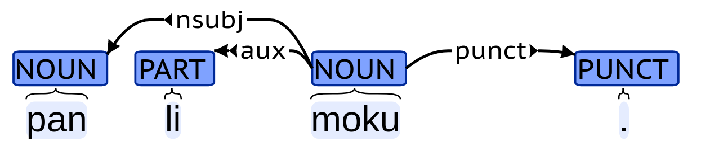

# Toki Pona UD

## はじめに

困ったことに，世の中にはたくさんの言語があります．
異なる言語の間で，共通の規則を用いて依存構造のアノテーションを行うための枠組みとして，Universal Dependencyと呼ばれるものがあります．
また，その中で使われている品詞体系として，Universal POS tagsと呼ばれるものもあります．
nymwaさんは，トキポナ版のUniversal DependencyやUniversal POS tagsを設計しようと思い立ち，頑張っています．
今回のアドベントカレンダーでは，その中で得られた知見を共有します．

## Universal Dependency

Universal Dependencyは，さまざまな言語での言語横断的な構文の構造を設計するための試みです．よくUDと省略されます．
「いろんな言語の構文解析を同じ枠組みでやるぞー」という思想の人たちが，それを実現するために頑張って作っています．
UDが始まったのは2014年のことで，それから100以上の言語でUDが設計されています．
UDにもいろいろありますが，この記事で出てくるUDは，UD version 2.です．
詳しいことは，https://universaldependencies.org/ かあるいは，https://aclanthology.org/2020.lrec-1.497.pdf を見てくれもふ≡╹ω╹≡．

UDでは，Universal POS tagsとして，17種類の品詞タグセットを採用しています．
以下に，Universal POS tagsのすべてのタグを示します．

| タグ | 意味 |
| --- | --- |
| ADJ | 形容詞 |
| ADP | 接置詞 |
| ADV | 副詞 |
| AUX | auxiliary (助動詞など) |
| CCONJ | 等位接続詞 |
| DET | 限定詞 |
| INTJ | 間投詞 |
| NOUN | 名詞 |
| NUM | 数詞 |
| PART | 接辞，小辞 |
| PRON | 代名詞 |
| PROPN | 固有名詞 |
| PUNCT | 約物 |
| SCONJ | 従属接続詞 |
| SYM | 記号 |
| VERB | 動詞 |
| X | その他 |

トキポナでUDをするためには，まずすべての単語がどのUniversal POS tagsのタグを取りうるかを考える必要があります．

Universal Dependencyの係り受けは，その"言語横断的"という特徴から，句構造（構文木とか）を考慮したものではなく，
すべての構文関係を，単語間の依存関係と係り受けタグで表現します．
UDの係り受けタグは，なんかよくわからんが[たくさんあり](https://universaldependencies.org/u/dep/index.html)ます．
これらのすべてをトキポナと関連付けようとするとしんどいので，以降は
[jan Nankoのトキポナ文法解説ツイート](https://twitter.com/leenamgwang/status/1409484535151042568)
の例文を用いて，トキポナUDについて説明していきます．

## pan li moku.

