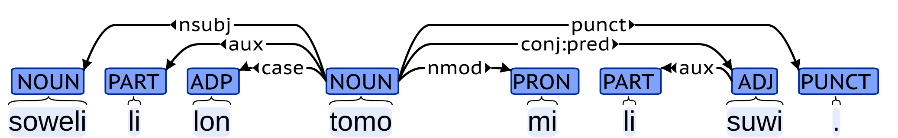
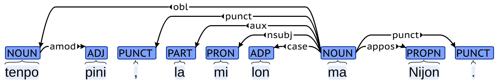
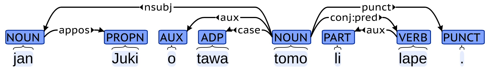

# Toki Pona UD

## はじめに

困ったことに，世の中にはたくさんの言語があります．
異なる言語の間で，共通の規則を用いて依存構造のアノテーションを行うための枠組みとして，Universal Dependencyと呼ばれるものがあります．
また，その中で使われている品詞体系として，Universal POS tagsと呼ばれるものもあります．
nymwaさんは，トキポナ版のUniversal DependencyやUniversal POS tagsを設計しようと思い立ち，頑張っています．
今回のアドベントカレンダーでは，その中で得られた知見を共有します．

## Universal Dependency

Universal Dependencyは，さまざまな言語での言語横断的な構文の構造を設計するための試みです．よくUDと省略されます．
「いろんな言語の構文解析を同じ枠組みでやるぞー」という思想の人たちが，それを実現するために頑張って作っています．
UDが始まったのは2014年のことで，それから100以上の言語でUDが設計されています．
UDにもいろいろありますが，この記事で出てくるUDは，UD version 2.です．
詳しいことは，https://universaldependencies.org/ かあるいは，https://aclanthology.org/2020.lrec-1.497.pdf を見てくれもふ≡╹ω╹≡．

UDでは，Universal POS tagsとして，17種類の品詞タグセットを採用しています．
以下に，Universal POS tagsのすべてのタグを示します．

| タグ | 意味 |
| --- | --- |
| ADJ | 形容詞 |
| ADP | 接置詞 |
| ADV | 副詞 |
| AUX | auxiliary (助動詞など) |
| CCONJ | 等位接続詞 |
| DET | 限定詞 |
| INTJ | 間投詞 |
| NOUN | 名詞 |
| NUM | 数詞 |
| PART | 接辞，小辞 |
| PRON | 代名詞 |
| PROPN | 固有名詞 |
| PUNCT | 約物 |
| SCONJ | 従属接続詞 |
| SYM | 記号 |
| VERB | 動詞 |
| X | その他 |

トキポナでUDをするためには，まず，すべての単語がどのUniversal POS tagsのタグを取りうるかを考える必要があります．

Universal Dependencyの係り受けは，その"言語横断的"という特徴から，句構造（構文木とか）を考慮したものではなく，
すべての構文関係を，単語間の依存関係と係り受けタグで表現します．
UDの係り受けタグは，なんかよくわからんが[たくさんあり](https://universaldependencies.org/u/dep/index.html)ます．
これらのすべてをトキポナと関連付けようとするとしんどいので，以降は
[jan Nankoのトキポナ文法解説ツイート](https://twitter.com/leenamgwang/status/1409484535151042568)
の例文を用いて，トキポナUDについて説明していきます．

## 主部・述部

### pan li moku.

"pan li moku."は，「パンは食べ物だ」という意味であり，pan「パン」, moku「食べ物」は，NOUNです．
liは，主部と述部を分離する語です．
今回のトキポナUDでは，liは，PARTということにしました．これは異論もあるかもしれませんが，受け入れてください．
'.'は約物なので，PUNCTです．

係り受け解析では，ある語には別の語から矢印が飛んできます．
矢印の矢はず側，例えばこの図の「pan <- moku」のmoku側は，「panの主辞 (head)」と言います．
さらに，すべての語から主辞をたどって到達する語のことを，文の主辞 (root) と言います．この文では，mokuが文の主辞です．
文の主辞は必ず１つになります．
２つ以上ある場合は，それは，そもそも２つ以上の文ということになりますし，
主辞が０個という場合は，矢印の循環が起きるということになってしまいます．
係り受けの矢印は必ず循環しないように付ける必要があります．

UDでは，文の主辞以外のすべての語が，主辞を持ちます．つまり，どの語にも必ず何かしらの矢じりがついているということです．
ある語が２つ以上の主辞を持つことも許容されますが，今回のトキポナUDにおいては，そのようなことは起きないように設計しました．
つまり，トキポナUDでは，文の主辞以外のすべての語は，必ず１つの主辞を持ちます．

「pan <- moku」の係り受けには，nsubjのタグが付いています．これが，係り受けタグです．
nsubjは主語を表します．

「li <- moku」の係り受けは，auxです．auxは，一般に述語に係ってその役割を決定付けます．
英語の助動詞がそれで，時制や態，法，証拠性などを表します．
ただ，UDでは，述語以外の要素に役割を付与するような語にも，auxの使用を許しています．
トキポナには，そのような語（後述する，eやpiなど）が複数あります．
今回の例においては，liは述語の役割を決定付けるものであり，auxとするのが良いように思われます．

「moku -> .」の係り受けは，punctです．これは，約物であることを表します．

### kili li suwi.

"kili li suwi."は，「果物(kili)は甘い(suwi)」という意味であり，suwiは，ADJになります．

kiliが主語，suwiが述語となり，係り受けは，"pan li moku."の場合と全く同様になります．

### jan li moli.

"jan li moli."は，「人(jan)は死ぬ(moli)」という意味であり，moliは，VERBになります．

janが主語，moliが述語となり，係り受けは，また同様になります．

### kala li lon telo li pona moku.

"kala li lon telo li pona moku."は，「魚は水中にいて，おいしい」という意味です．

主語はkala「魚」ですが，述語は"li lon telo"と"li pona moku"の２つあります．
この場合，１つ目の述語の主部"telo"と２つ目の述語の主部"pona"が「telo -> pona」のように結び付けられ，その係り受けタグは，conj:predとなります．
conjは本来，２つの要素が等位構造を持つ場合，その関係を示す働きがあります．
トキポナの場合，等位構造にも複数の種類があり，本来の等位接続詞を用いる等位構造以外のものには，"conj:???"というふうに，なんらかの補足説明を付けるようにしました．
"conj:pred"のpredは，それが述語の等位関係，すなわち，"li ~~~ li ~~~ li ~~~"の関係にあることを意味します．

１つ目の述語，"li lon telo"は，前置詞lon「〜の中にある」からなる前置詞句です．
UDでは，前置詞句における主辞は前置詞ではなく，前置詞の後ろに来る名詞句となります．
そのため，「lon <- telo」と，この句の主辞はtelo「水」になります．
その係り受けタグは，格を意味する'case'になります．

２つ目の述語，"li pona moku"は，形容詞 'pona' 「良い」に，副詞 'moku' 「食べるために」が付き，「食べるために良い」-> 「おいしい」という意味です．
副詞の修飾は'advmod'タグで表されるため，「pona -> moku」の関係は，advmodです．

約物の係り受けは，複数の述語に対しては，先頭のものに係ります．

### mi pilin ike li moli.

"mi pilin ike li moli."は，「私はつらくて死んだ」という意味です．

この例も，述語が２つあります．いずれも述語は動詞句で，１つ目の"pilin(感じる) ike(悪く)"は，動詞句に副詞修飾があるのみで，これまで説明した内容で理解できます．

## 修飾

### lipu loje, tomo sina, tawa sewi, moku mute, pona kute

名詞lipu「葉」に対して，形容詞loje「赤い」が係る名詞句です．
形容詞修飾語を表すamodタグが付けられています．

名詞tomo「家」に対して，代名詞sina「あなた」が係る名詞句です．
名詞修飾語を表すnmodタグが付けられています．

動詞tawa「行く・飛ぶ」に対して，副詞「高く」が係る動詞句です．
副詞修飾語を表すadvmodタグが付けられています．

名詞sewi「空」に対して，前置詞tawa「〜の方へ」が係る前置詞句です．
格標識を表すcaseが付けられています．

１つ前の"tawa sewi"と同じ句ですが，意味合いは微妙に違ってきています．
前者は「高いところを飛ぶ」という，移動の動詞に場所の副詞を組み合わせた空間性の移動表現であるのに対し，
後者は「空の方へ行く・飛んでいく」という，動作の方向や状態の変化を表す前置詞を用いた方向性の移動表現です．

この違いが文脈上明確な場合には，係り受けは一意に定められるべきですが，どちらの意味にも取れる場合，
すなわち，意味に曖昧さがある場合には，２通り以上の注釈を行うことが望ましいと言えます．

名詞moku「食べ物」に対して，形容詞「たくさんの」が係る名詞句です．
形容詞修飾語を表すamodタグが付けられています．

動詞moku「食べる」に対して，副詞「たくさん」が係る動詞句です．
副詞修飾語を表すadvmodが付けられています．

この２例も，曖昧さの問題があります．
曖昧さはトキポナにおいて非常に重要な問題です．
そもそも，トキポナにおいて名詞や動詞，形容詞や副詞という分類を用いることに否定的な立場もあります．
たしかに，この区別がトキポナの形態論や統語論に与える影響は，ほとんどの場合においてはありません．
しかし，時間的経過を伴わない事物と，動作・状態の間での区別を文脈から行うことは，人間の言語一般において自然なことと考えることもできますし，
係り受け解析の問題や，あるいは意味・語用の問題として，この区別の問題に取り組むことは，決してナンセンスなことではないとも言うことができるのではないかと思います．

形容詞pona「良い」に対して，副詞「聞くために」が係る形容詞句です．「聞き心地が良い」と訳されます．
kuteは，名詞では「耳」，動詞では「聞く」，副詞では「聞くために」となります．
トキポナ文の解釈においては，文脈上適切な品詞・語義の選択をする必要があります．

## 前置詞

### ona li lon ma ni.

### soweli li lape lon insa lupa.

### soweli lon tomo mi li suwi.

## 否定

### kasi li toki ala.

### kasi li toki e ala.

### akesi li suwi ala.

### jan ala li moku e kiwen.

## 動作の対象

### soweli li moku e kasi.

### mama li alasa e kili e soweli.

## 諾否疑問

### sina moku ala moku e soweli?

### ni li pipi ala pipi?

### waso li tawa sewi anu seme?

## 選択疑問・疑問詞疑問

### sina moku e seme?

### jan seme li kama?

### sina olin e mi anu ona?

## piの用法

### kala suli mute

### kala pi suli mute

## 固有名詞

### jan Talo, toki Inli, ma Tosi, jan Tosi

## laの用法

### jan olin li pilin pona, la mi pilin pona.

### tenpo pini, la mi lon ma Nijon.

### tan seme, la jan li moli?

## 数と色

### jan luka luka tu tu wan

### jan Silo li kama nanpa tu wan.

### jan mute li esun e len laso jelo.

## 文を受けるni

### mi tawa ala tan ni: sijelo mi li ike.

### mi sona e ni tan lipu: ona li ike ala.

## 小辞

Toki Ponaの公式文法書では小辞(particle)という表現が使われていますが，これは，UDのparticleとは意味が異なってきます．

### mi pali mute. taso mi jo e mani lili.

### moku ni en telo ni li pona a.

### jan Janako o, lawa sina li pona.

## 助動詞

### mi wile tawa ma Osaka.

### jan Jumi li ken ala ken moku e kala?

## 命令

### jan mute o musi.

### o kute.

### sina o moku mute.

### jan Juki o tawa tomo li lape.

## わかったこと・おもったこと・わからないこと

## 課題と今後の展望

